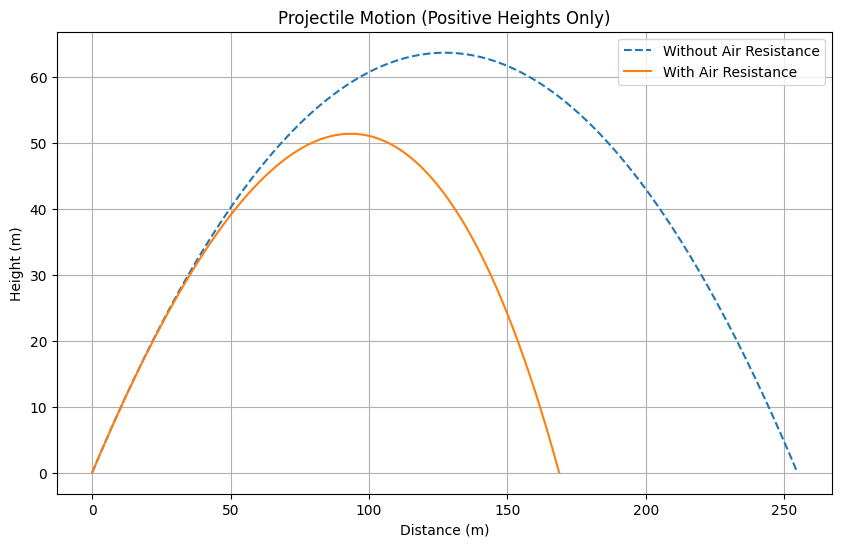
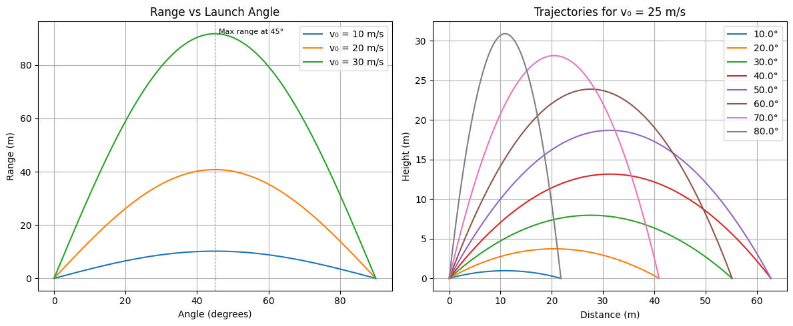

# 1. Theoretical Foundation: Equations of Projectile Motion

## 1.1 Overview

Projectile motion describes the two-dimensional motion of an object launched into the air, subject only to the force of gravity (ideal case). The motion can be analyzed using Newton's Second Law and decomposed into horizontal and vertical components.

---

## 1.2 Newton’s Second Law

Newton’s Second Law in vector form:

$$\vec{F}=m\vec{a}$$

For projectile motion without air resistance, the only force acting on the body is gravity:

$$\vec{F}=-mg\hat{j} \Rightarrow \vec{a}=-g\hat{j}$$

---

## 1.3 Decomposing the Motion

Let:
- $v_0$: initial velocity  
- $\theta$: angle of projection from the horizontal  
- $v_{0x}=v_0\cos\theta$: initial velocity in the x-direction  
- $v_{0y}=v_0\sin\theta$: initial velocity in the y-direction  
- $g$: acceleration due to gravity

---

## 1.4 Solving Differential Equations of Motion

### Horizontal Motion

The horizontal acceleration is zero ($a_x=0$):

$$\frac{d^2x}{dt^2}=0 \Rightarrow \frac{dx}{dt}=v_{0x} \Rightarrow x(t)=v_{0x}t$$

Thus,

$$x(t)=v_0\cos\theta\cdot t$$

### Vertical Motion

The vertical acceleration is $a_y=-g$:

$$\frac{d^2y}{dt^2}=-g \Rightarrow \frac{dy}{dt}=v_{0y}-gt \Rightarrow y(t)=v_{0y}t-\frac{1}{2}gt^2$$

So,

$$y(t)=v_0\sin\theta\cdot t - \frac{1}{2}gt^2$$

---

## 1.5 Parametric Equations of Motion

The full motion is described by:

$$x(t)=v_0\cos\theta\cdot t$$  
$$y(t)=v_0\sin\theta\cdot t - \frac{1}{2}gt^2$$

These form a *parabolic trajectory* when $y$ is expressed in terms of $x$.

---

## 1.6 Family of Solutions with Varying Initial Conditions

Let’s explore how different parameters affect the trajectory:

### 1.6.1 Varying Initial Velocity $v_0$

- Larger $v_0$ increases both range and maximum height.
- The time of flight also increases.

### 1.6.2 Varying Angle $\theta$

- The range is maximized at $\theta=45^\circ$ (under symmetric conditions).
- Complementary angles $\theta$ and $90^\circ-\theta$
# 2. Analysis of the Range

## 2.1 Horizontal Range of a Projectile

The *range* $R$ of a projectile is the horizontal distance it travels before returning to the same vertical level from which it was launched.

We start from the horizontal and vertical motion equations:

- Horizontal displacement:  
  $$x(t)=v_0\cos\theta\cdot t$$

- Vertical displacement:  
  $$y(t)=v_0\sin\theta\cdot t-\frac{1}{2}gt^2$$

Assuming the projectile lands at the same height it was launched ($y=0$), solve for *time of flight* $T$:

$$
0=v_0\sin\theta\cdot T-\frac{1}{2}gT^2 \\
\Rightarrow T=\frac{2v_0\sin\theta}{g}
$$

Substitute $T$ into $x(T)$ to find the *range*:

$$
R=x(T)=v_0\cos\theta\cdot\frac{2v_0\sin\theta}{g}=\frac{v_0^2\sin(2\theta)}{g}
$$

---

## 2.2 Dependence of Range on the Angle of Projection

The range is given by:

$$R=\frac{v_0^2\sin(2\theta)}{g}$$

### Key observations:

- *$\sin(2\theta)$* is maximum when $2\theta=90^\circ\Rightarrow\theta=45^\circ$.
- For a fixed initial speed $v_0$, the range is symmetric with respect to $\theta=45^\circ$.
  - i.e., $\theta$ and $(90^\circ-\theta)$ give the same range.
- This relationship forms a *sine curve* when plotted against $\theta$ from $0^\circ$ to $90^\circ$.

---

## 2.3 Influence of Other Parameters

### 2.3.1 Initial Velocity $v_0$

- Range increases *quadratically* with initial velocity:

$$R\propto v_0^2$$

- Doubling $v_0$ quadruples the range.

### 2.3.2 Gravitational Acceleration $g$

- Range is *inversely proportional* to gravity:

$$R\propto\frac{1}{g}$$

- Higher gravity results in a shorter range (e.g., on Jupiter vs. Moon).

---

## 2.4 Maximum Range Condition

To maximize $R$, we analyze:

$$R=\frac{v_0^2\sin(2\theta)}{g}$$

The sine function has its maximum at $2\theta=90^\circ$, so:

$$
\boxed{\theta_\text{max}=45^\circ}
$$

This angle gives the *maximum possible horizontal range* under the assumption that the launch and landing heights are equal and air resistance is negligible.

---

## 2.5 Graphical Insight

A plot of $R$ vs. $\theta$ for a fixed $v_0$ and $g$ would show:

- A symmetric curve peaking at $\theta=45^\circ$.
- The curve follows the form of $\sin(2\theta)$.

This reinforces the analytical result.

---

## 2.6 Summary

| Parameter           | Influence on Range                                              |
|--------------------|-----------------------------------------------------------------|
| Launch angle $\theta$ | $R$ maximized at $45^\circ$; symmetric for $\theta$ and $90^\circ-\theta$ |
| Initial speed $v_0$   | $R\propto v_0^2$                                              |
| Gravity $g$           | $R\propto\frac{1}{g}$                                         |

The analysis shows that range is a function of trigonometric behavior and quadratic scaling, influenced by both kinematic input and environmental factors.

---


# 3. Practical Applications

Projectile motion is not only a theoretical construct but also highly relevant in many real-world contexts. While the basic model assumes ideal conditions, it forms the foundation upon which more complex and realistic models can be built.

---

## 3.1 Applications in Real-World Scenarios

### 3.1.1 Sports

In sports like football, basketball, or golf, players rely on instinct and experience to control *initial velocity* $v_0$ and *launch angle* $\theta$ to achieve a desired range or height.

For example:

- In basketball, to make a successful shot:
  - The player must optimize $\theta$ depending on distance from the hoop.
  - The parabolic trajectory is described by:

    $$y(x)=x\tan\theta-\frac{gx^2}{2v_0^2\cos^2\theta}$$

- In soccer, goalkeepers estimate the projectile path of a shot to determine interception points.

---

### 3.1.2 Engineering and Ballistics

Projectile motion governs:

- The *trajectory of artillery shells*
- *Rocket launches* during early flight phases
- *Throwing mechanisms* in robotics or machines

Adjusting parameters like $v_0$, $\theta$, and launch height $h$ are critical for targeting.

---

### 3.1.3 Terrain and Uneven Ground

When landing elevation differs from launch elevation, time of flight and range change.

Assuming launch height $h>0$, vertical motion becomes:

$$
y(t)=h+v_0\sin\theta\cdot t-\frac{1}{2}gt^2
$$

Solving for the time $T$ when $y(T)=0$ gives:

$$
T=\frac{v_0\sin\theta+\sqrt{(v_0\sin\theta)^2+2gh}}{g}
$$

Then the range is:

$$
R=v_0\cos\theta\cdot T
$$

This model is closer to real-world launches, like a drone dropped from a height or skiing off a slope.

---

## 3.2 Air Resistance and Drag

In realistic scenarios, *air resistance* affects motion significantly, especially at high speeds.

### 3.2.1 Drag Force Model

A basic drag model (linear with velocity):

$$
F_d=-kv
$$

Where:

- $k$ is the drag coefficient,
- $v$ is the velocity vector.

This leads to *nonlinear* differential equations:

- Horizontal:  
  $$m\frac{dv_x}{dt}=-kv_x$$

- Vertical:  
  $$m\frac{dv_y}{dt}=-mg-kv_y$$

Solving these yields *exponentially decaying velocities*:

$$
v_x(t)=v_{0x}e^{-kt/m},\quad v_y(t)=\left(v_{0y}+\frac{mg}{k}\right)e^{-kt/m}-\frac{mg}{k}
$$

This results in:

- A *shorter range*
- A *steeper descent*
- *Asymmetry* in the trajectory path

---

## 3.3 Why the Idealized Model Fails

### 3.3.1 Assumptions in the Ideal Model

- No air resistance
- Flat, level ground
- Constant gravitational field
- No spin or lift forces
- Point-mass projectile

These assumptions simplify analysis but *break down* in most physical scenarios.

---



[link](https://colab.research.google.com/drive/1FnrAgjaUZVid3GkKYB2NrMwgeK-wHLLF?usp=sharing)

### 3.3.2 Realistic Factors Affecting Trajectory

| Factor                | Effect on Motion                                  |
|-----------------------|---------------------------------------------------|
| Air resistance        | Reduces range, alters shape of trajectory         |
| Varying terrain       | Changes landing point and time of flight          |
| Wind                  | Can push projectile off-course                    |
| Altitude              | Affects air density and gravity slightly          |
| Projectile shape/spin | Introduces lift forces (e.g., Magnus effect)      |

---
## 3.4 Summary

The classical model of projectile motion serves as a *first approximation* for real systems. However, for accurate prediction and control, especially in sports, aerospace, or engineering, *extended models* incorporating environmental and mechanical factors are necessary.

Despite its limitations, understanding the ideal case is essential before progressing to more complex analyses.

---

## phyton-plot



```python

import numpy as np
import matplotlib.pyplot as plt

# Constants
gravity = 9.81  # m/s²
angles = np.linspace(0, 90, 18)  # launch angles for trajectory plot
velocities = [10, 20, 30]        # m/s for range vs angle plot

# --- Plot 1: Range vs Angle for different velocities ---
def compute_range(v0, angle_deg, g=gravity):
    angle_rad = np.radians(angle_deg)
    return (v0**2) * np.sin(2 * angle_rad) / g

angle_range = np.linspace(0, 90, 200)

plt.figure(figsize=(12, 5))

# Subplot 1: Range vs Angle
plt.subplot(1, 2, 1)
for v in velocities:
    ranges = [compute_range(v, angle) for angle in angle_range]
    plt.plot(angle_range, ranges, label=f'v₀ = {v} m/s')
plt.title('Range vs Launch Angle')
plt.xlabel('Angle (degrees)')
plt.ylabel('Range (m)')
plt.legend()
plt.grid(True)
plt.axvline(45, color='gray', linestyle='--', linewidth=0.7)
plt.text(46, compute_range(velocities[-1], 45), 'Max range at 45°', fontsize=8)

# --- Plot 2: Trajectory curves for one velocity and different angles ---
def trajectory(v0, angle_deg, g=gravity):
    angle_rad = np.radians(angle_deg)
    t_flight = 2 * v0 * np.sin(angle_rad) / g
    t = np.linspace(0, t_flight, num=100)
    x = v0 * np.cos(angle_rad) * t
    y = v0 * np.sin(angle_rad) * t - 0.5 * g * t**2
    return x, y

# Subplot 2: Trajectories
plt.subplot(1, 2, 2)
v0 = 25  # fixed initial speed
for angle in angles:
    x, y = trajectory(v0, angle)
    plt.plot(x, y, label=f'{angle}°')

plt.title(f'Trajectories for v₀ = {v0} m/s')
plt.xlabel('Distance (m)')
plt.ylabel('Height (m)')
plt.legend()
plt.grid(True)

plt.tight_layout()
plt.show()

```
[link](https://colab.research.google.com/drive/1e2QXDho4tA5cKSAJFBBFYzcgtdQKDCPK?usp=sharing)