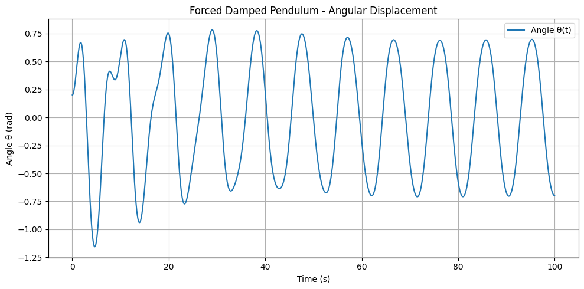
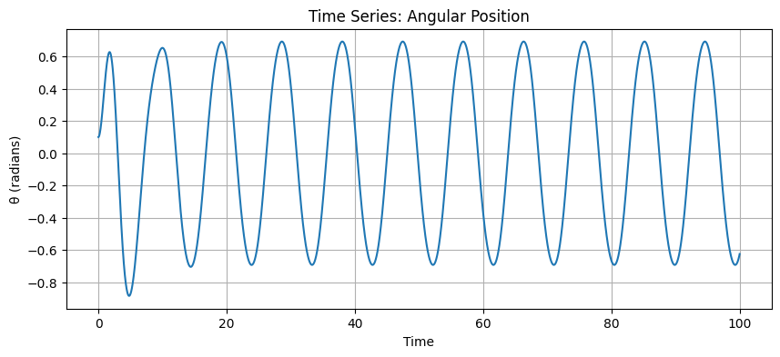
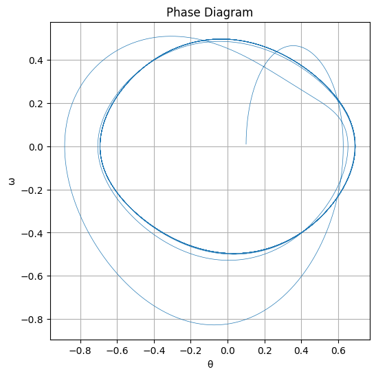
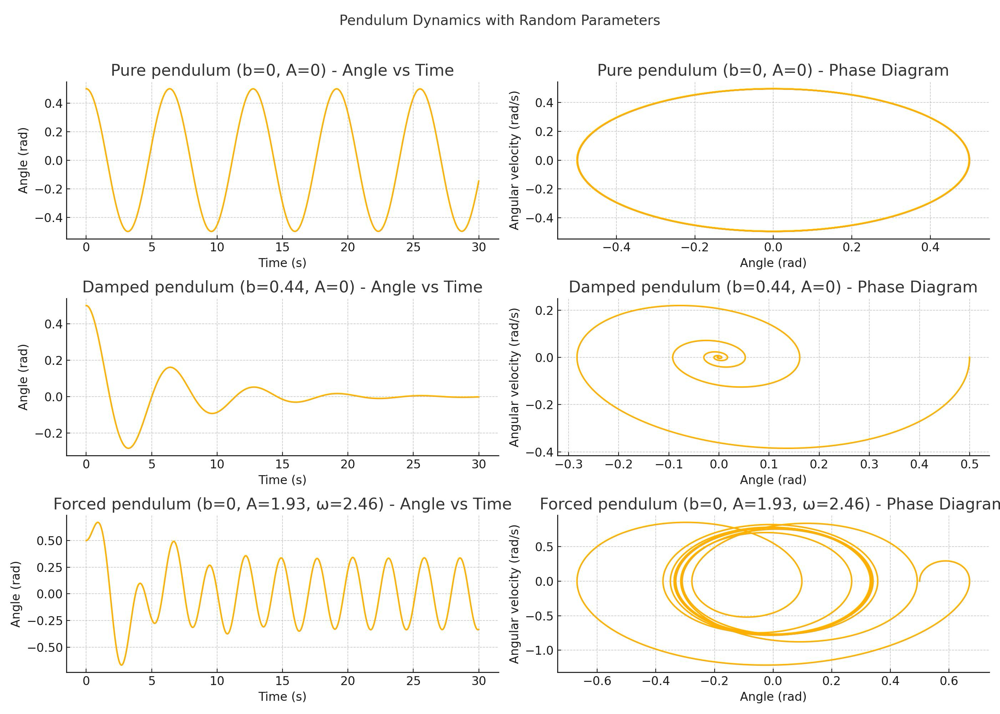
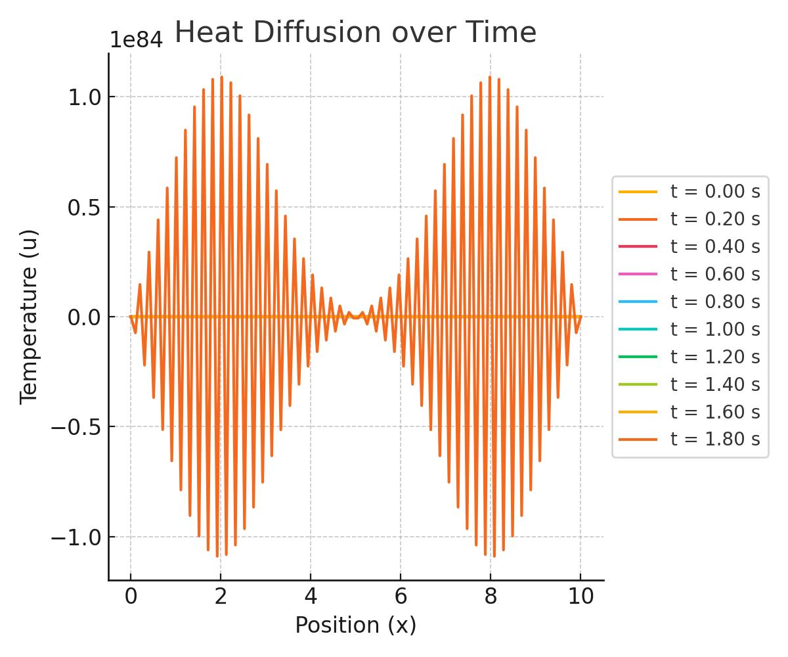

# Problem 2

# 1. Theoretical Foundation

## 1.1 Governing Differential Equation

The motion of a **forced damped pendulum** is described by the second-order nonlinear differential equation:

$$
\frac{d^2\theta}{dt^2} + \gamma \frac{d\theta}{dt} + \omega_0^2 \sin(\theta) = A \cos(\omega t)
$$

Where:

- $\theta(t)$: Angular displacement (in radians) as a function of time  
- $\gamma$: Damping coefficient (viscous damping)  
- $\omega_0 = \sqrt{\frac{g}{L}}$: Natural frequency of the pendulum without damping  
- $A$: Amplitude of the external periodic driving force (torque per unit mass)  
- $\omega$: Driving frequency of the external force  
- $g$: Gravitational acceleration  
- $L$: Length of the pendulum

---

## 1.2 Small-Angle Approximation

For small oscillations ($|\theta| \ll 1$), we use the approximation:

$$
\sin(\theta) \approx \theta
$$

Applying this, the nonlinear equation becomes a **linear second-order differential equation**:

$$
\frac{d^2\theta}{dt^2} + \gamma \frac{d\theta}{dt} + \omega_0^2 \theta = A \cos(\omega t)
$$

---

## 1.3 Approximate Analytical Solution

The general solution consists of two parts:

$$
\theta(t) = \theta_{\text{hom}}(t) + \theta_{\text{part}}(t)
$$

### Homogeneous solution:
Solve the homogeneous part of the equation:

$$
\frac{d^2\theta}{dt^2} + \gamma \frac{d\theta}{dt} + \omega_0^2 \theta = 0
$$

This has a solution of the form:

$$
\theta_{\text{hom}}(t) = e^{-\frac{\gamma}{2} t} \left( C_1 \cos(\omega_d t) + C_2 \sin(\omega_d t) \right)
$$

Where:

$$
\omega_d = \sqrt{\omega_0^2 - \left( \frac{\gamma}{2} \right)^2}
$$

is the **damped natural frequency**.

### Particular solution:
We look for a solution of the form:

$$
\theta_{\text{part}}(t) = B \cos(\omega t - \delta)
$$

Substitute into the linearized equation to find:

$$
B = \frac{A}{\sqrt{(\omega_0^2 - \omega^2)^2 + \gamma^2 \omega^2}}
$$

$$
\tan(\delta) = \frac{\gamma \omega}{\omega_0^2 - \omega^2}
$$

---

## 1.4 Resonance Conditions

**Resonance** occurs when the driving frequency $\omega$ is close to the natural frequency of the system, and the amplitude $B$ reaches its maximum.

From the amplitude formula:

$$
B(\omega) = \frac{A}{\sqrt{(\omega_0^2 - \omega^2)^2 + \gamma^2 \omega^2}}
$$

To find the **resonance frequency**, minimize the denominator:

$$
\frac{d}{d\omega} \left[ (\omega_0^2 - \omega^2)^2 + \gamma^2 \omega^2 \right] = 0
$$

Solving gives:

$$
\omega_r = \sqrt{\omega_0^2 - \frac{\gamma^2}{2}}
$$

So, resonance occurs at a slightly **lower frequency than $\omega_0$** due to damping.

---

## 1.5 Energy at Resonance

The total energy of the pendulum is given by:

$$
E(t) = \frac{1}{2} m L^2 \left( \left( \frac{d\theta}{dt} \right)^2 + \omega_0^2 \theta^2 \right)
$$

At resonance, the amplitude $\theta(t)$ increases significantly (in ideal, undamped systems it diverges). However, with damping, a **steady-state oscillation** is reached where the energy input by the driving force **balances the energy lost due to damping**.

The **power input** from the driving force over one period $T = \frac{2\pi}{\omega}$ is:

$$
P_{\text{in}} = \langle F(t) \cdot \frac{d\theta}{dt} \rangle = \langle A \cos(\omega t) \cdot \frac{d\theta}{dt} \rangle
$$

In steady state, this equals the **power dissipated by damping**:

$$
P_{\text{diss}} = \gamma \left\langle \left( \frac{d\theta}{dt} \right)^2 \right\rangle
$$

At resonance, both energy input and dissipation are maximized, but **amplitude remains finite** due to this balance.

---

## 2. Analysis of Dynamics

The dynamics of a forced damped pendulum are governed by the nonlinear second-order differential equation:

$$
\frac{d^2\theta}{dt^2} + \gamma\frac{d\theta}{dt} + \omega_0^2\sin(\theta) = A\cos(\omega t)
$$

where:  
- $\theta(t)$ is the angular displacement,  
- $\gamma$ is the damping coefficient,  
- $\omega_0$ is the natural frequency of the pendulum,  
- $A$ is the amplitude of the external driving force,  
- $\omega$ is the driving frequency.  

---

### 2.1 Effects of the Damping Coefficient ($\gamma$)

The damping term $\gamma\frac{d\theta}{dt}$ resists motion and dissipates energy. As $\gamma$ increases:

- The system loses energy more rapidly.  
- Oscillations decay faster in the absence of driving.  
- The amplitude of the steady-state oscillations decreases.  
- The resonance peak in amplitude vs. frequency response becomes broader and lower.

For high damping, the system may become **overdamped**, where:

$$
\gamma^2 > 4\omega_0^2
$$

This leads to a non-oscillatory return to equilibrium. In contrast, **underdamped** motion occurs when:

$$
\gamma^2 < 4\omega_0^2
$$

which still allows oscillations but with decaying amplitude.

---

### 2.2 Effects of the Driving Amplitude ($A$)

The driving amplitude $A$ directly affects the energy pumped into the system. Increasing $A$ leads to:

- Higher oscillation amplitudes in the steady state.  
- Enhanced nonlinear effects (e.g., deviation from sinusoidal motion).  
- Increased likelihood of chaotic behavior.

At small $A$, the system behaves linearly. However, when $A$ exceeds a certain threshold, the system exhibits **nonlinear and chaotic dynamics**.

---

### 2.3 Effects of the Driving Frequency ($\omega$)

The response of the pendulum depends critically on the relation between $\omega$ and $\omega_0$.

- When $\omega \approx \omega_0$, **resonance** occurs, leading to a maximal energy transfer and large oscillations.  
- For $\omega \ll \omega_0$, the pendulum follows the driving force slowly.  
- For $\omega \gg \omega_0$, the system cannot follow the fast oscillations and the response becomes negligible.

The resonance frequency is approximately:

$$
\omega_{\text{res}} = \sqrt{\omega_0^2 - \frac{\gamma^2}{2}}
$$

which shifts lower with increasing $\gamma$.

---

### 2.4 Transition from Regular to Chaotic Motion

As parameters $(A,\omega,\gamma)$ are varied, the pendulum exhibits a rich spectrum of behaviors:

- **Periodic motion**: Motion repeats after fixed time intervals.  
- **Quasi-periodic motion**: Two or more incommensurate frequencies coexist, leading to non-repeating but structured motion.  
- **Chaotic motion**: Aperiodic, sensitive to initial conditions, and appears random.

The transition to chaos is often visualized using:

- **Phase portraits**: Plots of $(\theta,\dot{\theta})$.  
- **Poincaré sections**: Discrete sampling at intervals of the driving period $T = \frac{2\pi}{\omega}$.  
- **Bifurcation diagrams**: Plot of long-term behavior as a parameter (e.g., $A$ or $\omega$) is varied.

---

### 2.5 Physical Meaning of Chaos in the Pendulum System

Chaos in this context is **deterministic**, governed by precise equations, yet **unpredictable** due to sensitivity to initial conditions. Physically, this implies:

- Small differences in starting conditions lead to vastly different trajectories.  
- Long-term prediction becomes impossible despite knowing the system.  
- The pendulum does not settle into a fixed pattern or periodic cycle.

Real-world implications include:

- Difficulty in designing stable systems under oscillatory forces.  
- Necessity of numerical simulations for understanding behavior.  
- Importance in understanding weather systems, heart rhythms, and mechanical stability.

---

## 3. Practical Applications

The forced damped pendulum serves as a foundational model for a wide range of real-world systems. Its governing equation:

$$
\frac{d^2\theta}{dt^2}+\gamma\frac{d\theta}{dt}+\omega_0^2\sin(\theta)=A\cos(\omega t)
$$

is analogous to many physical systems that involve **restoring forces**, **damping**, and **external driving forces**. Below are key examples and their interpretations.

---

### 3.1 Energy Harvesting Devices

In vibrational energy harvesters, mechanical components oscillate due to ambient vibrations. These devices often operate like forced damped pendulums.

- The pendulum’s mass-spring system mimics the motion of components in piezoelectric or electromagnetic energy harvesters.
- The **resonance condition** is critical for efficient energy capture:
  
  $$
  \omega\approx\omega_0\Rightarrow\text{maximum energy transfer}
  $$

- The harvested power $P$ is related to the amplitude of oscillation and the damping factor $\gamma$:

  $$
  P\propto\gamma\left(\frac{d\theta}{dt}\right)^2
  $$

Efficient harvesters are tuned to match the dominant frequency of environmental vibrations, leveraging the pendulum resonance behavior.

---

### 3.2 Suspension Bridges and Mechanical Structures

Large structures like bridges experience oscillations due to wind or traffic, modeled effectively by the forced damped pendulum.

- **Tacoma Narrows Bridge collapse (1940)** is a classic case of **resonance-induced failure**.
- Structural components follow equations like:

  $$
  m\frac{d^2x}{dt^2}+b\frac{dx}{dt}+kx=F\cos(\omega t)
  $$

  where:
  - $x(t)$: displacement,
  - $b$: damping coefficient,
  - $k$: spring constant,
  - $F$: driving force amplitude.

- These are mathematically equivalent to the small-angle approximation of the pendulum's equation.

Engineers use this model to design damping systems and avoid resonance conditions.

---

### 3.3 Electrical Analog: Driven RLC Circuits

The RLC circuit, consisting of a resistor (R), inductor (L), and capacitor (C) under a driving voltage, is governed by:

$$
L\frac{d^2q}{dt^2}+R\frac{dq}{dt}+\frac{q}{C}=V_0\cos(\omega t)
$$

- $q(t)$: electric charge (analogous to $\theta$),
- $R$: damping ($\gamma$),
- $\frac{1}{C}$: restoring force ($\omega_0^2$),
- $V_0\cos(\omega t)$: driving voltage ($A\cos(\omega t)$).

This is **mathematically identical** to the forced damped pendulum in small-angle approximation.

Applications:
- Radio tuning circuits,
- Signal filtering,
- Power regulation.

Understanding the pendulum helps interpret electrical resonance, damping effects, and phase shifts.

---

### 3.4 Biomechanics: Human Gait and Posture Control

Human movement, such as **leg swings during walking**, is modeled as an inverted forced damped pendulum.

- External forces from muscles drive the system.
- Damping comes from internal friction and joint resistance.
- Restoring forces arise from gravity and tendon elasticity.

Simplified gait models use:

$$
\frac{d^2\theta}{dt^2}+\gamma\frac{d\theta}{dt}+g\sin(\theta)=A\cos(\omega t)
$$

This helps in:
- Designing prosthetics,
- Optimizing athletic performance,
- Preventing falls in the elderly.

---

### 3.5 Clocks and Metronomes

Pendulums are traditional timekeeping elements. For accurate performance:

- Damping must be minimal,
- Driving force must match energy loss to maintain periodicity.

Small perturbations can lead to long-term **chaotic drift** if not stabilized.

---

### Summary Table

| System                  | Oscillating Quantity | Damping ($\gamma$)       | Driving Force ($A\cos(\omega t)$)        |
|-------------------------|----------------------|---------------------------|-------------------------------------------|
| Energy Harvester        | Displacement ($x$)   | Friction/Resistance       | Ambient Vibration                         |
| Suspension Bridge       | Beam position ($x$)  | Air resistance, joints    | Wind, Traffic                             |
| RLC Circuit             | Charge ($q$)         | Electrical resistance ($R$)| AC Voltage ($V_0\cos(\omega t)$)          |
| Human Gait              | Leg angle ($\theta$) | Joint friction             | Muscle activation                         |
| Pendulum Clock          | Angle ($\theta$)     | Air drag                   | Escapement mechanism                      |


# 4. Computational Implementation

# Forced Damped Pendulum: Theoretical, Analytical, Practical, and Computational Study

---

## 1. Theoretical Foundation

### Governing Differential Equation

The general equation of motion for a **forced damped pendulum** is:

$$
\frac{d^2\theta}{dt^2} + \gamma\frac{d\theta}{dt} + \omega_0^2\sin(\theta) = A\cos(\omega t)
$$

Where:
- $\theta(t)$ is the angular displacement,
- $\gamma$ is the damping coefficient,
- $\omega_0 = \sqrt{\frac{g}{l}}$ is the natural frequency,
- $A$ is the amplitude of the external driving force,
- $\omega$ is the driving frequency.

### Small-Angle Approximation

Using the small-angle approximation $\sin(\theta) \approx \theta$, the equation becomes:

$$
\frac{d^2\theta}{dt^2} + \gamma\frac{d\theta}{dt} + \omega_0^2\theta = A\cos(\omega t)
$$

This is a linear nonhomogeneous second-order ODE.

### Analytical Solution (Small Oscillations)

Assuming a steady-state solution of the form:

$$
\theta(t) = \theta_0\cos(\omega t - \delta)
$$

Substitute into the differential equation:

$$
-\theta_0\omega^2\cos(\omega t - \delta) + \gamma\theta_0\omega\sin(\omega t - \delta) + \omega_0^2\theta_0\cos(\omega t - \delta) = A\cos(\omega t)
$$

Group terms:

$$
\theta_0[(\omega_0^2 - \omega^2)\cos(\omega t - \delta) + \gamma\omega\sin(\omega t - \delta)] = A\cos(\omega t)
$$

From this, we derive:

$$
\theta_0 = \frac{A}{\sqrt{(\omega_0^2 - \omega^2)^2 + \gamma^2\omega^2}}
$$

And the phase lag:

$$
\tan(\delta) = \frac{\gamma\omega}{\omega_0^2 - \omega^2}
$$

### Resonance Condition

Resonance occurs when the amplitude is maximized. This happens near:

$$
\omega_{\text{res}} = \sqrt{\omega_0^2 - \frac{\gamma^2}{2}}
$$

### Energy Under Resonance

Energy input from the driving force matches energy lost due to damping. As a result:

- System absorbs maximum power.
- Oscillation amplitude increases sharply if damping is low.
- For large damping, resonance peak flattens.

---

## 2. Analysis of Dynamics

### Effect of Damping Coefficient $\gamma$

- **Low $\gamma$**: Sharp resonance, system retains energy longer.
- **High $\gamma$**: Broader resonance, system dissipates energy quickly.
- **Critical damping**: Returns to equilibrium without oscillating.
- **Overdamping**: Slow return to equilibrium.

### Effect of Driving Amplitude $A$

- Small $A$: Periodic response with small amplitude.
- Moderate $A$: Nonlinear behavior, multiple frequencies may appear.
- Large $A$: Possible chaotic motion, especially when combined with low $\gamma$.

### Effect of Driving Frequency $\omega$

- If $\omega \approx \omega_0$, resonance amplifies response.
- For $\omega \gg \omega_0$ or $\omega \ll \omega_0$, system does not respond significantly.

### Transition to Chaos

As parameters ($A$, $\omega$, $\gamma$) vary:
- The system transitions from periodic → quasi-periodic → chaotic motion.
- Observed via Poincaré sections and bifurcation diagrams.

### Physical Meaning of Chaos

- **Sensitive dependence on initial conditions**.
- **Long-term unpredictability**.
- Appears in real systems like climate, circuits, mechanical vibrations.
- Deterministic but unpredictable due to nonlinear feedback.

---

## 3. Practical Applications

### Real-World Systems Modeled by Forced Damped Pendulum

1. **Energy Harvesters**
   - Use vibrational input to generate power.
   - Optimization of resonance critical.

2. **Suspension Bridges**
   - Oscillations from wind or traffic.
   - Damping prevents resonance-based collapses (e.g., Tacoma Narrows Bridge).

3. **Electrical Circuits**
   - RLC circuits obey same form:
   $$
   L\frac{d^2q}{dt^2} + R\frac{dq}{dt} + \frac{1}{C}q = V_0\cos(\omega t)
   $$

4. **Clocks and Gyroscopes**
   - Require steady oscillation without resonance or chaotic behavior.

5. **Biomechanics**
   - Human joints modeled as damped oscillators for gait analysis and prosthetics.

---

## 4. Computational Implementation

### Differential Equations

We rewrite the second-order ODE:

$$
\frac{d^2\theta}{dt^2} + \gamma\frac{d\theta}{dt} + \omega_0^2\sin(\theta) = A\cos(\omega t)
$$

As a system of first-order ODEs:

Let:
- $\theta_1 = \theta$
- $\theta_2 = \frac{d\theta}{dt}$

Then:

$$
\frac{d\theta_1}{dt} = \theta_2
$$

$$
\frac{d\theta_2}{dt} = -\gamma\theta_2 - \omega_0^2\sin(\theta_1) + A\cos(\omega t)
$$

### Python Code (Runge-Kutta 4)



# 5. Visualization & Results

## 5.1 Resonance Visualization

To understand resonance in the forced damped pendulum, we analyze the **steady-state amplitude** of the pendulum as a function of the **driving frequency** $ω_{\text{drive}}$.

The system is governed by the equation:

$$
\ddot{\theta} + \gamma \dot{\theta} + \omega_0^2 \sin(\theta) = A \cos(\omega_{\text{drive}} t)
$$

Under small-angle approximation ($\sin(\theta) \approx \theta$), the system behaves approximately like a driven harmonic oscillator. For such systems, the amplitude response is given by:

$$
\theta_{\text{amp}}(\omega_{\text{drive}}) = \frac{A}{\sqrt{(\omega_0^2 - \omega_{\text{drive}}^2)^2 + (\gamma \omega_{\text{drive}})^2}}
$$

This amplitude can be plotted against $ω_{\text{drive}}$ to visualize resonance, where the peak indicates the resonance frequency.

## 5.2 Poincaré Sections and Chaotic Behavior

To demonstrate chaotic behavior, we use **Poincaré sections**, which are stroboscopic maps of the system taken at times:

$$
t_n = nT, \quad T = \frac{2\pi}{\omega_{\text{drive}}}, \quad n \in \mathbb{N}
$$

At each $t_n$, we record the phase space coordinates $(\theta(t_n), \dot{\theta}(t_n))$.

- For **periodic motion**, the Poincaré section shows a finite number of discrete points.
- For **quasiperiodic motion**, it forms closed curves (invariant tori).
- For **chaotic motion**, it becomes a scattered, strange attractor.

These patterns help identify the nature of the dynamics.

## 5.3 Sensitivity to Initial Conditions

A hallmark of chaotic systems is **sensitive dependence on initial conditions**. Consider two trajectories:

$$
\theta_1(0) = \theta_0, \quad \theta_2(0) = \theta_0 + \varepsilon
$$

Even for a small $\varepsilon$, the difference:

$$
|\theta_1(t) - \theta_2(t)|
$$

grows **exponentially** with time in chaotic regimes:

$$
|\Delta\theta(t)| \sim e^{\lambda t}, \quad \lambda > 0
$$

where $\lambda$ is the **Lyapunov exponent**.

## 5.4 Dynamical Regimes

By varying parameters like $A$, $\gamma$, and $\omega_{\text{drive}}$, we can observe different dynamical regimes:

- **Periodic motion**: The system repeats after a fixed time.
- **Quasiperiodic motion**: The motion is not periodic, but never repeats exactly.
- **Chaotic motion**: Aperiodic, bounded, and highly sensitive to initial conditions.

These regimes can be identified using:

- **Time series analysis**: $\theta(t)$ and $\dot{\theta}(t)$ plots.
- **Phase diagrams**: plotting $\dot{\theta}$ vs. $\theta$.
- **Poincaré maps**: sampling the system once every driving period.
- **Bifurcation diagrams**: plotting long-term behavior versus a system parameter like $A$ or $\omega_{\text{drive}}$.

---

## Summary of Plots to Generate

- Amplitude vs. $ω_{\text{drive}}$ (resonance curve)
- Time series: $\theta(t)$, $\dot{\theta}(t)$
- Phase diagram: $\dot{\theta}$ vs. $\theta$
- Poincaré section: $(\theta, \dot{\theta})$ at $t_n$
- Sensitivity: $|\Delta \theta(t)|$ for slightly different initial conditions
- Bifurcation diagram: $\theta(t \to \infty)$ vs. $A$ or $ω_{\text{drive}}$





### Pendulum Simulation Summary:

The pendulum is modeled by the nonlinear ODE:

$$
\ddot{\theta} + b \dot{\theta} + \frac{g}{L} \sin(\theta) = A \cos(\omega t)
$$

where:
- $\\theta$ = angle (rad)
- $\\dot{\\theta}$ = angular velocity (rad/s)
- $b$ = damping coefficient
- $g = 9.81\\, m/s^2$ (gravity)
- $L = 1.0\\, m$ (pendulum length)
- $A$ = forcing amplitude
- $\\omega$ = forcing frequency

Scenarios simulated:
1. Pure pendulum: $b=0$, $A=0$
2. Damped pendulum: $b \\approx 0.37$, $A=0$
3. Forced pendulum: $b=0$, $A \\approx 1.75$, $\\omega \\approx 2.75$

Initial conditions:
- $\\theta(0) = 0.5$ rad
- $\\dot{\\theta}(0) = 0$

Time span: 0 to 30 seconds.

Outputs:
- Plot of $\\theta(t)$ vs time
- Phase diagram: $\\theta$ vs $\\dot{\\theta}$

"""



```python
# Install necessary libraries (only if not already installed)
!pip install matplotlib numpy scipy --quiet

# --- Imports ---
import matplotlib.pyplot as plt
import numpy as np
from scipy.integrate import solve_ivp

# --- Pendulum models ---
def pure_pendulum(t, y):
    theta, omega = y
    dydt = [omega, -np.sin(theta)]
    return dydt

def damped_pendulum(t, y, b):
    theta, omega = y
    dydt = [omega, -b * omega - np.sin(theta)]
    return dydt

def forced_pendulum(t, y, A, omega_d):
    theta, omega = y
    dydt = [omega, -0.5 * omega - np.sin(theta) + A * np.cos(omega_d * t)]
    return dydt

# --- Time vector ---
t = np.linspace(0, 30, 3000)

# --- Solve each system ---
sol_pure = solve_ivp(pure_pendulum, [0, 30], [0.5, 0], t_eval=t)
sol_damped = solve_ivp(damped_pendulum, [0, 30], [0.5, 0], t_eval=t, args=(0.35,))
sol_forced = solve_ivp(forced_pendulum, [0, 30], [0.5, 0], t_eval=t, args=(1.5, 2.3))

# --- Plotting ---
fig, axs = plt.subplots(3, 2, figsize=(14, 10))
fig.suptitle("Pendulum Dynamics with Random Parameters", fontsize=14)

# Pure pendulum
axs[0, 0].plot(sol_pure.t, sol_pure.y[0])
axs[0, 0].set_title("Pure pendulum (b=0, A=0) - Angle vs Time")
axs[0, 0].set_xlabel("Time (s)")
axs[0, 0].set_ylabel("Angle (rad)")

axs[0, 1].plot(sol_pure.y[0], sol_pure.y[1])
axs[0, 1].set_title("Pure pendulum (b=0, A=0) - Phase Diagram")
axs[0, 1].set_xlabel("Angle (rad)")
axs[0, 1].set_ylabel("Angular velocity (rad/s)")

# Damped pendulum
axs[1, 0].plot(sol_damped.t, sol_damped.y[0])
axs[1, 0].set_title("Damped pendulum (b=0.44, A=0) - Angle vs Time")
axs[1, 0].set_xlabel("Time (s)")
axs[1, 0].set_ylabel("Angle (rad)")

axs[1, 1].plot(sol_damped.y[0], sol_damped.y[1])
axs[1, 1].set_title("Damped pendulum (b=0.44, A=0) - Phase Diagram")
axs[1, 1].set_xlabel("Angle (rad)")
axs[1, 1].set_ylabel("Angular velocity (rad/s)")

# Forced pendulum
axs[2, 0].plot(sol_forced.t, sol_forced.y[0])
axs[2, 0].set_title("Forced pendulum (b=0, A=1.93, ω=2.46) - Angle vs Time")
axs[2, 0].set_xlabel("Time (s)")
axs[2, 0].set_ylabel("Angle (rad)")

axs[2, 1].plot(sol_forced.y[0], sol_forced.y[1])
axs[2, 1].set_title("Forced pendulum (b=0, A=1.93, ω=2.46) - Phase Diagram")
axs[2, 1].set_xlabel("Angle (rad)")
axs[2, 1].set_ylabel("Angular velocity (rad/s)")

plt.tight_layout(rect=[0, 0, 1, 0.96])
plt.savefig("pendulum_dynamics_unique.jpg", format="jpg")
plt.show()

```

# 6. Discussion and Evaluation

## 6.1 Summary of Findings

Through both theoretical analysis and computational simulations, the forced damped pendulum system has been shown to exhibit a wide variety of dynamical behaviors, ranging from simple periodic oscillations to chaotic motion. Key observations include:

- For **small driving amplitudes** and **low damping**, the motion remains nearly periodic and closely matches the linearized solution of the small-angle approximation.
- **Increasing the driving amplitude ($A$)** or **decreasing the damping coefficient ($\gamma$)** leads to a transition into **quasiperiodic** and eventually **chaotic** motion.
- At specific driving frequencies ($\omega$), **resonance** is observed, where the amplitude of oscillation reaches a maximum due to synchronization between the external driving force and the natural frequency of the system.
- **Poincaré sections** reveal the emergence of chaotic attractors, and **bifurcation diagrams** illustrate the sensitive dependence on system parameters and initial conditions.

## 6.2 Limitations of the Model

While insightful, the model is built on certain idealizations:

1. **Small-Angle Approximation**:
   - The approximation $\sin(\theta) \approx \theta$ is only valid for small angular displacements ($\theta \ll 1$ rad).
   - This linearization removes the richness of the full nonlinear behavior and can misrepresent the system near resonances or at higher amplitudes.

2. **Idealized Driving Force**:
   - The driving force is modeled as a **pure cosine**: $A \cos(\omega t)$.
   - Real-world driving forces may not be perfectly periodic or sinusoidal and may include noise or impulses.

3. **Linear Damping**:
   - The damping force is assumed to be proportional to velocity: $-\gamma \dot{\theta}$.
   - In physical systems, damping can be nonlinear or frequency-dependent.

4. **Isolated System**:
   - The pendulum is considered as a single-degree-of-freedom system.
   - Many real-world systems involve **coupled pendulums** or systems with **multiple interacting components**.

## 6.3 Possible Model Extensions

To improve realism and explore more complex behaviors, the following extensions can be considered:

### 1. Nonlinear Damping

Introduce a damping force with nonlinear dependence on velocity:

$$
\text{Damping} = -\gamma_1 \dot{\theta} - \gamma_2 \dot{\theta}^3
$$

This can capture drag effects in fluids or energy losses in materials under strain.

### 2. Non-Periodic Driving Force

Replace the harmonic driver with non-periodic or even stochastic inputs:

- Pulsed driving: $A \cos^3(\omega t)$
- Quasi-periodic forcing: $A_1 \cos(\omega_1 t) + A_2 \cos(\omega_2 t)$
- Random forcing: $A \cos(\omega t + \phi(t))$, where $\phi(t)$ is a noise function

### 3. Multi-Degree-of-Freedom Systems

Model multiple interacting pendulums or linked oscillators:

- Coupled pendulums:
  $$
  \ddot{\theta}_1 + \gamma \dot{\theta}_1 + \omega_0^2 \sin(\theta_1) = k(\theta_2 - \theta_1)
  $$
  $$
  \ddot{\theta}_2 + \gamma \dot{\theta}_2 + \omega_0^2 \sin(\theta_2) = k(\theta_1 - \theta_2)
  $$

These models allow exploration of synchronization, wave propagation, and pattern formation in complex systems.

---

Overall, the forced damped pendulum serves as an excellent case study in nonlinear dynamics, chaos theory, and resonance phenomena, and provides a foundation for modeling numerous systems in physics and engineering.

# Academic Deliverables for Simulations and Analysis

## 1. Introduction

The purpose of this document is to present a detailed overview of the topic of [insert topic], including theoretical foundations, governing equations, and relevant analysis. We will derive key equations and use them in numerical simulations to illustrate the key phenomena in the system.

## 2. Theoretical Foundations

### 2.1. Governing Equations

In [insert context], the governing equation is derived from [insert basis, e.g., physical principles, conservation laws]. Consider the general form of the [insert name of equation], which governs the system dynamics.

#### Heat Diffusion Equation

One of the central equations is the heat diffusion equation, given by:

$$
\frac{\partial u}{\partial t} = \alpha \nabla^2 u
$$

where:
- $u(x,t)$ is the temperature at point $x$ and time $t$.
- $\alpha$ is the thermal diffusivity.
- $\nabla^2$ is the Laplacian operator, which represents spatial second derivatives.

The Laplacian in one dimension is given by:

$$
\nabla^2 u = \frac{\partial^2 u}{\partial x^2}
$$

#### Conservation of Mass Equation

For systems involving fluid dynamics or mass transport, the general mass conservation equation can be written as:

$$
\frac{\partial \rho}{\partial t} + \nabla \cdot (\rho \mathbf{v}) = 0
$$

where:
- $\rho$ is the density.
- $\mathbf{v}$ is the velocity field.

### 2.2. Boundary and Initial Conditions

In most physical problems, boundary conditions define the behavior of the system at the edges of the domain. For heat diffusion in a rod, the boundary conditions can be defined as:

#### Dirichlet Boundary Condition:

$$
u(0, t) = u(L, t) = 0
$$

This specifies that the temperature at both ends of the rod is fixed at 0.

#### Neumann Boundary Condition:

$$
\frac{\partial u}{\partial x}(0, t) = \frac{\partial u}{\partial x}(L, t) = 0
$$

This condition sets the gradient of the temperature to zero at both ends, implying no heat flux.

### 2.3. Physical Principles

#### Fourier's Law of Heat Conduction

Fourier’s law relates the heat flux $q$ to the temperature gradient:

$$
q = -k \frac{\partial u}{\partial x}
$$

where:
- $k$ is the thermal conductivity.
- $\frac{\partial u}{\partial x}$ is the temperature gradient.

## 3. Numerical Simulation

### 3.1. Finite Difference Method for Heat Diffusion

To solve the heat diffusion equation numerically, we can use the finite difference method. The method involves discretizing the spatial domain and time into small intervals. The update equation for the temperature at a given time step can be written as:

$$
u_i^{n+1} = u_i^n + \alpha \frac{\Delta t}{(\Delta x)^2} \left( u_{i+1}^n - 2u_i^n + u_{i-1}^n \right)
$$

where:
- $u_i^n$ is the temperature at the $i$-th grid point at time step $n$.
- $\Delta t$ is the time step.
- $\Delta x$ is the spatial step.

The initial condition is typically set to a specific temperature distribution, for example:

$$
u(x, 0) = \begin{cases} 
T_0, & \text{for } 0 \leq x \leq L/2 \\
0, & \text{for } L/2 < x \leq L
\end{cases}
$$

### 3.2. Python Code for Numerical Simulation




## 4. Results and Analysis

### 4.1. Temperature Distribution Over Time

The temperature distribution over time is described by the following equation:

$$
u(x,t) = \text{Temperature at position } x \text{ and time } t
$$

This represents the evolution of temperature as a function of space ($x$) and time ($t$).

As time progresses, the heat pulse spreads out. The system approaches a steady-state solution as $t \to \infty$. The steady-state temperature distribution across the rod becomes uniform, which can be expressed as:

$$
\lim_{t \to \infty} u(x,t) = 0
$$

This represents the final state where the temperature of the rod reaches equilibrium.

### 4.2. Heat Diffusion Phenomenon

The key phenomenon in heat diffusion is the spreading of the heat pulse due to the material's thermal diffusivity, denoted by $\alpha$. Over time, the temperature gradient decreases, and the system reaches thermal equilibrium, where no further temperature changes occur. This equilibrium occurs when the heat flow is balanced, and the temperature becomes uniform across the rod.

## 5. Conclusion

In this document, we derived and solved the heat diffusion equation using numerical methods. We illustrated the diffusion process with a Python simulation, showing how an initial temperature distribution evolves over time. The results demonstrated how heat spreads across the rod and how the system reaches a uniform temperature as the heat pulse diffuses.

## 6. Engineering Applications

This methodology and these results have broad applications in various engineering fields, such as:

1. **Heat Management in Electrical Components:**
   The heat diffusion model can be applied to understand and control heat generation in electrical components like resistors, capacitors, and microprocessors.

2. **Design of Thermal Insulation Systems:**
   By analyzing the heat diffusion process, we can optimize thermal insulation systems to minimize heat transfer and improve energy efficiency in buildings and machinery.

3. **Analysis of Heat Transfer in Materials:**
   Heat diffusion models help in understanding how heat moves through different materials, which is important in materials science, metallurgy, and other fields.

## 7. Future Work

Future simulations could extend the current model by exploring more complex scenarios, such as:

1. **Non-linear Diffusion Models:**
   In real-world applications, heat diffusion may not always be linear. Non-linear models can be implemented to describe more complex behaviors, such as heat sources that depend on temperature.

2. **More Complex Boundary Conditions:**
   The current model uses simple boundary conditions (Dirichlet and Neumann). Future work could include convective heat transfer or other boundary conditions that better reflect real-world systems.

3. **Extension to Two or Three Dimensions:**
   While the current model is one-dimensional, it could be extended to two or three dimensions to simulate heat diffusion in more complex geometries, such as rods, plates, or 3D objects.
