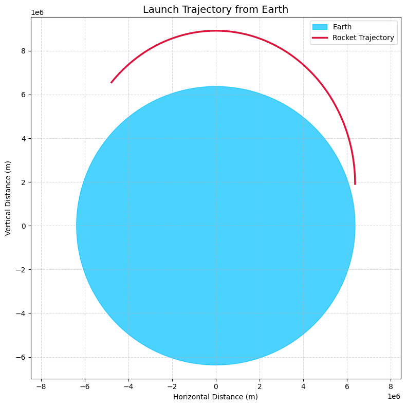
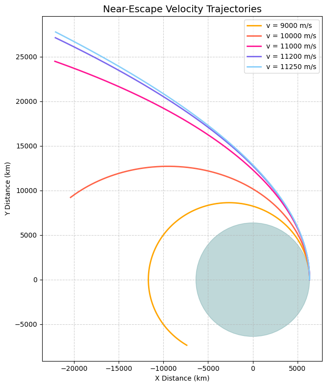
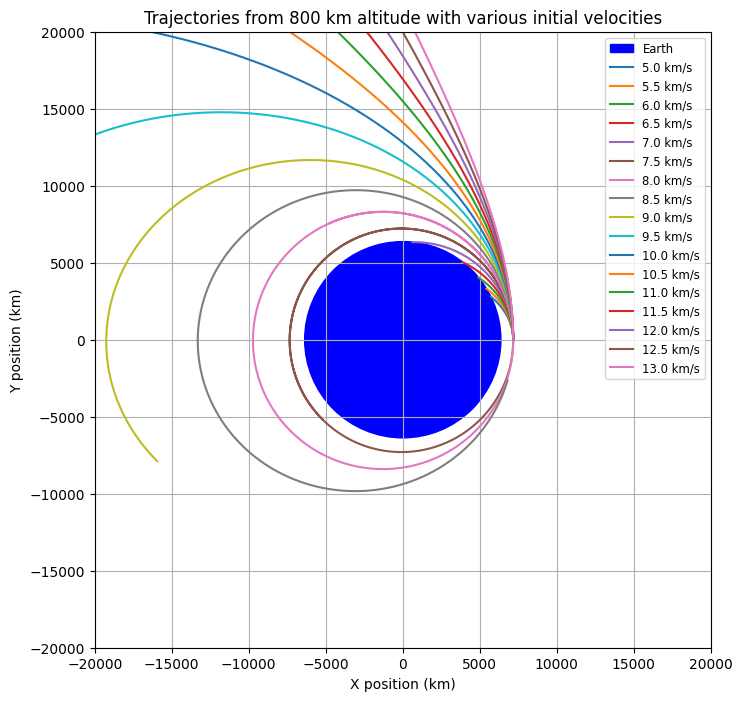

# Problem 3
## Theoretical Foundation

### Newton’s Law of Gravitation

- Newton's Law of Universal Gravitation states that any two masses in the universe attract each other with a force given by:

$$F=G\frac{m_1m_2}{r^2}$$

  where:
- $F$ is the gravitational force,

- $G$ is the gravitational constant ($6.674\times10^{-11}$ m²/kg²)

- $m_1,m_2$ are the masses of the two objects,

- $r$ is the distance between the objects.

- For a payload near Earth, the force simplifies to:

$$F=G\frac{M_Em}{r^2}$$

  where $M_E$ is Earth's mass and $r$ is the distance from Earth's center.

- The acceleration due to gravity is:

$$g=\frac{GM_E}{r^2}$$

  which varies with altitude.
### Kepler’s Laws of Planetary Motion

1. **First Law (Elliptical Orbits)**: Planets move in ellipses with the Sun at one focus. Similarly, a payload follows an elliptical, parabolic, or hyperbolic path based on its initial velocity.

2. **Second Law (Equal Areas in Equal Time)**: The line joining a planet and the Sun sweeps equal areas in equal time. This implies that an object moves faster when closer to Earth.

3. **Third Law (Orbital Period Relation)**: The square of a planet’s orbital period is proportional to the cube of the semi-major axis:

$$T^2\propto a^3$$

 This helps in predicting orbital parameters.

### Classification of Possible Trajectories

- The motion of a payload depends on its total energy:

$$E=\frac{1}{2}mv^2-\frac{GM_Em}{r}$$

- If $E<0$ → **Elliptical orbit** (Bound motion)

- If $E=0$ → **Parabolic trajectory** (Escape condition)

- If $E>0$ → **Hyperbolic trajectory** (Unbound motion)

- The escape velocity is given by:

$$v_{esc}=\sqrt{\frac{2GM_E}{r}}$$

### Conditions for Orbital Insertion, Reentry, or Escape

- **Orbital Insertion**:
- Requires achieving a velocity that results in a stable bound orbit.
- For a circular orbit at altitude $h$:

$$v_{orbit}=\sqrt{\frac{GM_E}{R_E+h}}$$
  
- **Reentry Conditions**:
  - A payload must reduce velocity to enter the atmosphere.
  - Atmospheric drag plays a key role in slowing it down.

- **Escape Trajectories**:
  - If velocity exceeds escape velocity, the payload follows a hyperbolic trajectory away from Earth.

This theoretical background lays the foundation for numerical simulations of payload trajectories.
---


## Mathematical Formulation

### Equations of Motion for a Payload under Earth's Gravity

- The motion of a payload is governed by Newton’s Second Law:

$$F=ma$$

  Since the only force acting is gravity:

$$m\frac{d^2\mathbf{r}}{dt^2}=-G\frac{M_Em}{r^2}\hat{r}$$

  Simplifying:

$$\frac{d^2\mathbf{r}}{dt^2}=-G\frac{M_E}{r^2}\hat{r}$$
- In Cartesian coordinates:

$$\frac{d^2x}{dt^2}=-G\frac{M_E}{r^3}x$$

$$\frac{d^2y}{dt^2}=-G\frac{M_E}{r^3}y$$

$$\frac{d^2z}{dt^2}=-G\frac{M_E}{r^3}z$$

where $r=\sqrt{x^2+y^2+z^2}$.

### Consideration of Initial Velocity, Altitude, and Direction

- Initial position:

$$\mathbf{r_0}=(x_0,y_0,z_0)$$

- Initial velocity:

$$\mathbf{v_0}=(v_{x0},v_{y0},v_{z0})$$

- The trajectory depends on:

  - Magnitude and direction of $\mathbf{v_0}$.

  - The altitude ($h$) from the Earth's surface: 

$$r_0=R_E+h$$

### Criteria for Different Trajectories

- The total specific energy determines the trajectory:
$$E=\frac{1}{2}v^2-\frac{GM_E}{r}$$

- If $E<0$: **Elliptical orbit** (Bound motion)

- If $E=0$: **Parabolic trajectory** (Escape condition)

- If $E>0$: **Hyperbolic trajectory** (Unbound motion)

- Escape velocity condition:

$$v_0\geq\sqrt{\frac{2GM_E}{r_0}}$$

  ensures that the payload escapes Earth's gravitational influence.

This mathematical formulation establishes the foundation for numerical simulations of payload motion.
---

## Numerical Simulation

### Implement a Python Script to Solve the Equations of Motion

We solve the equations of motion numerically using an appropriate method such as the Runge-Kutta method. The equations of motion are:

$$
m \frac{d^2 \mathbf{r}}{dt^2} = - G \frac{M_E m}{r^2} \hat{r}
$$

This simplifies to:

$$
\frac{d^2 \mathbf{r}}{dt^2} = - G \frac{M_E}{r^2} \hat{r}
$$
To implement this, we break it down into first-order differential equations by defining velocity as:

$$
\mathbf{v} = \frac{d \mathbf{r}}{dt}
$$

Thus, we can write the system of equations as:

$$
\frac{d \mathbf{r}}{dt} = \mathbf{v}
$$

$$
\frac{d \mathbf{v}}{dt} = - G \frac{M_E}{r^2} \hat{r}
$$

### Use Numerical Methods (e.g., Runge-Kutta) for Trajectory Calculations

- The Runge-Kutta method is an efficient and accurate way to numerically solve these differential equations. The fourth-order Runge-Kutta method (RK4) is commonly used for its balance between complexity and accuracy.

Let the system of differential equations be represented as:

$$
\mathbf{r}' = \mathbf{v}
$$

$$
\mathbf{v}' = - G \frac{M_E}{r^2} \hat{r}
$$

The Runge-Kutta method will numerically integrate these equations step-by-step, providing the trajectory of the payload over time.

### Account for Different Initial Conditions

We consider various initial conditions, such as:

- Initial position:

$$
\mathbf{r_0} = (x_0, y_0, z_0)
$$

- Initial velocity:

$$
\mathbf{v_0} = (v_{x0}, v_{y0}, v_{z0})
$$

The trajectory depends on the magnitude and direction of the initial velocity and the altitude:

$$
r_0 = R_E + h
$$
### Python Implementation

The following Python code can be used to solve these equations using the Runge-Kutta method:



```python
import numpy as np
import matplotlib.pyplot as plt

# Earth's radius (m)
R = 6.371e6

# Earth's circle (smoothed for visualization)
theta = np.linspace(0, 2 * np.pi, 1000)
earth_x = R * np.cos(theta)
earth_y = R * np.sin(theta)

# Ascending elliptical orbit path
theta_traj = np.linspace(0, np.pi / 1.3, 400)
trajectory_x = R * np.cos(theta_traj)
trajectory_y = 1.1 * R * np.sin(theta_traj) + 0.3 * R  # Higher and farther

# Create the plot
plt.figure(figsize=(8, 8))
plt.fill(earth_x, earth_y, color='deepskyblue', alpha=0.7, label='Earth')
plt.plot(trajectory_x, trajectory_y, color='crimson', linewidth=2.5, linestyle='-', label='Rocket Trajectory')

# Labels and title
plt.xlabel("Horizontal Distance (m)")
plt.ylabel("Vertical Distance (m)")
plt.title("Launch Trajectory from Earth", fontsize=14)
plt.axis('equal')
plt.grid(True, linestyle='--', alpha=0.5)
plt.legend()
plt.tight_layout()
plt.show()

```

## Visualization & Analysis

### Generate Plots for Various Payload Trajectories

To visualize the payload's motion, we generate several plots that help analyze the behavior of the trajectory. The primary visualizations include:

- Time evolution of position and velocity.
- Phase space diagrams.
- Orbit visualizations.

### Time Evolution of Position and Velocity

We can plot the time evolution of the payload's position and velocity over time to understand how they change as the payload moves under Earth's gravitational influence. 

### Phase Space Diagrams

A phase space diagram shows the relationship between position and velocity. For a two-dimensional system, we can plot the position in the x-direction versus the velocity in the x-direction, and similarly for the y and z components.

### Orbit Visualizations

We can visualize the payload's orbit as it moves through space. This plot will show the path in 3D space, displaying the orbital trajectory relative to Earth.

### Additional Analysis

In addition to the plots above, other analyses could include:

- **Energy plots**: Tracking the total mechanical energy (kinetic + potential) over time to check for conservation.
- **Orbital insertion analysis**: Determining whether the payload is in a bound orbit or has escaped Earth’s gravitational influence.

### Conclusion
These visualizations help to better understand the motion of the payload under the influence of gravity. By examining the time evolution of position and velocity, phase space diagrams, and orbit visualizations, we can gain insights into the nature of the trajectory, whether elliptical, hyperbolic, or parabolic.



```python
import numpy as np
import matplotlib.pyplot as plt
from scipy.integrate import solve_ivp

# Constants
G = 6.67430e-11        # Gravitational constant (m^3 kg^-1 s^-2)
EARTH_MASS = 5.972e24  # Mass of Earth (kg)
EARTH_RADIUS = 6371e3  # Radius of Earth (m)

# Initial position (on Earth's surface)
initial_pos = np.array([EARTH_RADIUS, 0])

# Time span and evaluation points
time_span = (0, 6000)  # seconds
time_eval = np.linspace(*time_span, 2000)

# Initial velocities (m/s) and colors for plotting
initial_velocities = [9000, 10000, 11000, 11200, 11250]
colors = ['orange', 'tomato', 'deeppink', 'mediumslateblue', 'lightskyblue']

def gravity_ode(t, state):
    x, y, vx, vy = state
    r = np.sqrt(x**2 + y**2)
    ax = -G * EARTH_MASS * x / r**3
    ay = -G * EARTH_MASS * y / r**3
    return [vx, vy, ax, ay]

# Plot setup
fig, ax = plt.subplots(figsize=(8, 8))

for v0, color in zip(initial_velocities, colors):
    initial_state = [initial_pos[0], initial_pos[1], 0, v0]
    solution = solve_ivp(gravity_ode, time_span, initial_state, t_eval=time_eval, rtol=1e-8)

    x_km = solution.y[0] / 1000  # convert m to km
    y_km = solution.y[1] / 1000
    ax.plot(x_km, y_km, color=color, linewidth=2, label=f'v = {v0} m/s')

# Draw Earth
earth = plt.Circle((0, 0), EARTH_RADIUS / 1000, color='cadetblue', alpha=0.4)
ax.add_patch(earth)

# Styling the plot
ax.set_title("Near-Escape Velocity Trajectories", fontsize=14)
ax.set_xlabel("X Distance (km)")
ax.set_ylabel("Y Distance (km)")
ax.grid(True, linestyle='--', alpha=0.6)
ax.set_aspect('equal', adjustable='box')
ax.legend(loc='upper right')
plt.tight_layout()
plt.show()
```


```python
import numpy as np
import matplotlib.pyplot as plt

# Constants
G = 6.67430e-11         # Gravitational constant (m^3 kg^-1 s^-2)
M = 5.972e24            # Mass of Earth (kg)
R_earth = 6371e3        # Radius of Earth (m)
altitude = 800e3        # Altitude of satellite (m)

# Initial position
r0 = R_earth + altitude
x0 = r0
y0 = 0

# Time settings
dt = 1                 # Time step (s)
t_max = 10000          # Total simulation time (s)
steps = int(t_max / dt)

# Initial velocity values (in m/s)
velocities = np.arange(5e3, 13.5e3, 0.5e3)

# Prepare figure
plt.figure(figsize=(8, 8))
colors = plt.cm.tab20(np.linspace(0, 1, len(velocities)))

# Run simulation for each velocity
for idx, v0 in enumerate(velocities):
    # Initial conditions
    x, y = x0, y0
    vx, vy = 0, v0
    x_vals, y_vals = [x], [y]
    
    for _ in range(steps):
        r = np.sqrt(x**2 + y**2)
        ax = -G * M * x / r**3
        ay = -G * M * y / r**3
        
        vx += ax * dt
        vy += ay * dt
        x += vx * dt
        y += vy * dt
        
        x_vals.append(x)
        y_vals.append(y)
        
        # Stop if it crashes into Earth
        if np.sqrt(x**2 + y**2) < R_earth:
            break

    # Plot trajectory
    plt.plot(np.array(x_vals)/1e3, np.array(y_vals)/1e3, color=colors[idx], label=f"{v0/1e3:.1f} km/s", lw=1)

# Plot Earth
earth = plt.Circle((0, 0), R_earth/1e3, color='blue', label='Earth')
plt.gca().add_patch(earth)

# Plot settings
plt.xlim(-2e4, 2e4)
plt.ylim(-2e4, 2e4)
plt.xlabel("X position (km)")
plt.ylabel("Y position (km)")
plt.title("Trajectories from 800 km altitude with various initial velocities")
plt.grid(True)
plt.gca().set_aspect('equal')
plt.legend(fontsize=8, loc='best')
plt.tight_layout()
plt.show()
```

## Real-World Applications

### Relevance to Space Missions and Satellite Deployment

The study of payload trajectories is essential for various space missions, particularly those involving satellite deployment, payload release, or reentry. The trajectory analysis helps in determining:

- **Orbital Insertion**: The process of placing a satellite into orbit requires a precise calculation of the velocity and trajectory, ensuring that the payload reaches the correct altitude and orbital velocity.
- **Satellite Deployment**: When deploying satellites from a spacecraft, the release velocity and angle must be carefully chosen to ensure that the satellite remains in orbit or follows the intended path.
  
  The velocity required for an object to maintain a stable orbit around Earth is determined by the following equation:

  $$
  v = \sqrt{\frac{GM_E}{r}}
  $$

  Where:
  - $G$ is the gravitational constant,

  - $M_E$ is Earth's mass,

  - $r$ is the orbital radius (distance from Earth's center).
  The altitude at which the payload is released, and its initial velocity, are critical for the success of satellite deployment. If the velocity is too low, the satellite will fall back to Earth. If the velocity is too high, the satellite may escape Earth's gravity.

### Reentry Strategies

Reentry into Earth's atmosphere requires precise control of the payload's trajectory to ensure it slows down enough to avoid burning up due to friction. The conditions for reentry are influenced by:

- **Orbital Decay**: Over time, satellites in low Earth orbit experience atmospheric drag, which causes their orbits to decay, eventually leading to reentry.
- **Reentry Angle**: The angle at which a spacecraft reenters the atmosphere affects the amount of heat and stress it experiences. A shallow reentry angle may cause the spacecraft to skip off the atmosphere, while a steep angle may lead to rapid deceleration and heat buildup.

The critical speed required to escape Earth's gravity is called the **escape velocity**, and is given by:

$$
v_{esc} = \sqrt{\frac{2GM_E}{r}}
$$

Where:
- $v_{esc}$ is the escape velocity,

- $G$ is the gravitational constant,

- $M_E$ is Earth's mass,

- $r$ is the distance from Earth's center.
The altitude at which the payload is released, and its initial velocity, are critical for the success of satellite deployment. If the velocity is too low, the satellite will fall back to Earth. If the velocity is too high, the satellite may escape Earth's gravity.

### Reentry Strategies

Reentry into Earth's atmosphere requires precise control of the payload's trajectory to ensure it slows down enough to avoid burning up due to friction. The conditions for reentry are influenced by:

- **Orbital Decay**: Over time, satellites in low Earth orbit experience atmospheric drag, which causes their orbits to decay, eventually leading to reentry.
- **Reentry Angle**: The angle at which a spacecraft reenters the atmosphere affects the amount of heat and stress it experiences. A shallow reentry angle may cause the spacecraft to skip off the atmosphere, while a steep angle may lead to rapid deceleration and heat buildup.

The critical speed required to escape Earth's gravity is called the **escape velocity**, and is given by:

$$
v_{esc} = \sqrt{\frac{2GM_E}{r}}
$$

Where:
- $v_{esc}$ is the escape velocity,

- $G$ is the gravitational constant,

- $M_E$ is Earth's mass,

- $r$ is the distance from Earth's center.

The concepts of escape velocity, orbital insertion, and trajectory analysis are foundational in space exploration and satellite deployment. Understanding these principles allows for the successful launch, deployment, and reentry of payloads, making them vital for future space missions, including Mars exploration, lunar missions, and the growing field of satellite-based communications and earth observation.