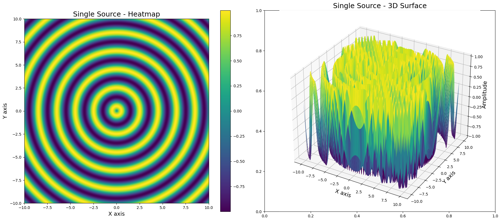
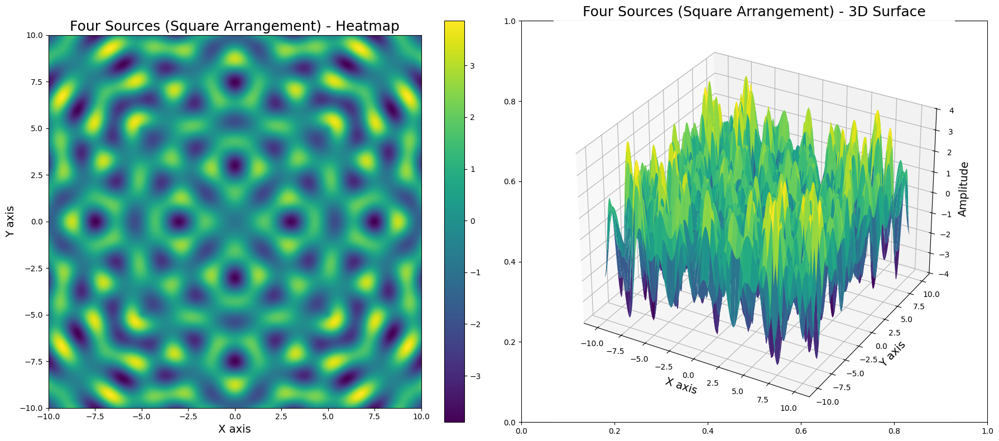

# Problem 1
# **Wave Interference Patterns on a Water Surface**

## **1. Selecting a Regular Polygon**

### **Introduction**
In wave physics, interference occurs when two or more waves overlap, resulting in regions of constructive and destructive interference. To systematically analyze these patterns, we consider multiple point wave sources positioned at the vertices of a **regular polygon**. This setup allows us to explore how symmetric arrangements of sources influence the resulting wave field.

### **Mathematical Definition of a Regular Polygon**
A **regular polygon** with $N$ sides is a closed geometric figure where all sides are of equal length and all internal angles are equal. The vertices of such a polygon, when inscribed in a circle of radius $R$, can be determined using trigonometric functions.

For a polygon centered at the origin, the coordinates of the $i$-th vertex are given by:

$$x_i=R\cos\left(\frac{2\pi i}{N}\right),\quad y_i=R\sin\left(\frac{2\pi i}{N}\right),\quad i=0,1,2,\dots,N-1$$

where:
- $R$ is the circumradius of the polygon,

- $N$ is the number of sides (hence, the number of sources),

- $i$ indexes the vertices counterclockwise starting from an initial reference point.
### **Choosing the Regular Polygon**

The choice of $N$ influences the symmetry of the interference pattern. Common selections include:

- **Equilateral Triangle ($N=3$)**: Yields a threefold symmetric interference pattern.

- **Square ($N=4$)**: Produces a fourfold symmetric pattern with central and diagonal wave reinforcements.

- **Pentagon ($N=5$)**: Generates more complex wave interactions with fivefold rotational symmetry.

- **Hexagon ($N=6$)**: Approximates circular symmetry while retaining noticeable interference fringes.

---

## **2. Positioning the Sources**

### **Determining the Coordinates of the Polygonal Vertices**
To systematically analyze interference, we must precisely position the wave sources at the vertices of a chosen regular polygon. Given a polygon inscribed within a circle of radius $R$, the coordinates of its vertices are:

$$x_i=R\cos\left(\frac{2\pi i}{N}\right),\quad y_i=R\sin\left(\frac{2\pi i}{N}\right),\quad i=0,1,2,\dots,N-1$$

### **Assigning Each Vertex as a Wave Source**
Each vertex serves as a point source emitting circular waves with identical amplitude and frequency. The total wave field results from the superposition of these waves.

Each wave propagates outward from its source with a displacement function:

$$\eta_i(x,y,t)=\frac{A}{r_i}\cos\left(kr_i-\omega t+\phi_i\right)$$

where:

- $r_i=\sqrt{(x-x_i)^2+(y-y_i)^2}$ is the radial distance to the observation point.

---
## **3. Defining the Wave Equations**

### **Mathematical Representation of Wave Motion**
Each wave emitted from a point source follows the equation:

$$\eta_i(x,y,t)=\frac{A}{r_i}\cos\left(kr_i-\omega t+\phi_i\right)$$

where:

- $A$ is the amplitude,

- $k=\frac{2\pi}{\lambda}$ is the wave number,

- $\omega=2\pi f$ is the angular frequency,

- $\phi_i$ is the phase,

- $r_i$ is the radial distance from the $i$-th source.

### **Uniformity Assumptions**
To maintain coherence in interference analysis, we assume:

- All waves have **the same amplitude**, i.e., $A$ is constant.

- All waves have **the same wavelength** $\lambda$ and frequency $f$.

- Initial phase differences between sources remain fixed.

---
## **4. Applying the Superposition Principle**

### **Summation of Wave Displacements**

According to the principle of superposition, the resultant displacement at any point on the water surface is the sum of individual wave contributions:

$$\eta_{\text{sum}}(x,y,t)=\sum_{i=1}^{N}\eta_i(x,y,t)$$

This summation captures constructive and destructive interference effects.

### **Constructive and Destructive Interference Conditions**

- **Constructive interference:** Occurs when phase differences satisfy:

$$kr_i-\omega t+\phi_i=2m\pi,\quad m\in\mathbb{Z}$$

- **Destructive interference:** Occurs when phase differences satisfy:

$$kr_i-\omega t+\phi_i=(2m+1)\pi,\quad m\in\mathbb{Z}$$

---

## **5. Analyzing the Interference Patterns**

### **Identifying Interference Zones**
By computing $\eta_{\text{sum}}(x,y,t)$, we can classify different regions:
- **High amplitude zones:** Result from constructive interference.
- **Low amplitude zones:** Result from destructive interference.
### **Temporal Evolution of the Pattern**
As time progresses, the interference pattern evolves dynamically, influenced by wave frequency and phase differences.

---

## **6. Visualization and Simulation**

### **Graphical Representations**
Using numerical simulations, we generate:
- **Static interference maps** for different polygons.
- **Time-evolving wave fields** to observe changing interference dynamics.

### **Python Implementation**
A Python script implementing the above equations will:
1. Define wave parameters.
2. Compute the interference pattern on a 2D grid.
3. Visualize results using heatmaps and contour plots.

The next step is to implement and analyze these interference patterns computationally.




```python
import numpy as np
import matplotlib.pyplot as plt
from mpl_toolkits.mplot3d import Axes3D

# Create spatial grid
x_vals = np.linspace(-10, 10, 500)
y_vals = np.linspace(-10, 10, 500)
X, Y = np.meshgrid(x_vals, y_vals)

# Wave parameters
wavelength = 2.0               # Wavelength in units
wave_number = 2 * np.pi / wavelength  # Wave number k
angular_freq = 2 * np.pi / 5          # Angular frequency ω
time = 0                             # Time snapshot (static)

# Generate wave pattern from a single point source
def wave_from_source(X, Y, source_pos):
    distance = np.sqrt((X - source_pos[0])**2 + (Y - source_pos[1])**2)
    return np.sin(wave_number * distance - angular_freq * time)

# Superpose waves from multiple sources
def combined_wave(X, Y, source_positions):
    total_wave = np.zeros_like(X)
    for pos in source_positions:
        total_wave += wave_from_source(X, Y, pos)
    return total_wave

# Define source positions
single_source = [(0, 0)]

square_distance = 5
four_sources_square = [
    (-square_distance, -square_distance),
    (-square_distance,  square_distance),
    ( square_distance, -square_distance),
    ( square_distance,  square_distance)
]

pentagon_radius = 5
pentagon_angles = np.linspace(0, 2 * np.pi, 6)[:-1]  # 5 points equally spaced
five_sources_pentagon = [(pentagon_radius * np.cos(a), pentagon_radius * np.sin(a)) for a in pentagon_angles]

# Plotting function for heatmap and 3D surface
def plot_wave_pattern(Z, plot_title):
    fig, axs = plt.subplots(1, 2, figsize=(18, 8))

    # Heatmap view
    heatmap = axs[0].imshow(Z, extent=[-10, 10, -10, 10], origin='lower', cmap='viridis')
    axs[0].set_title(f"{plot_title} - Heatmap", fontsize=18)
    axs[0].set_xlabel("X axis", fontsize=14)
    axs[0].set_ylabel("Y axis", fontsize=14)
    plt.colorbar(heatmap, ax=axs[0])

    # 3D surface plot
    ax3d = fig.add_subplot(1, 2, 2, projection='3d')
    ax3d.plot_surface(X, Y, Z, cmap='viridis', edgecolor='none')
    ax3d.set_title(f"{plot_title} - 3D Surface", fontsize=18)
    ax3d.set_xlabel("X axis", fontsize=14)
    ax3d.set_ylabel("Y axis", fontsize=14)
    ax3d.set_zlabel("Amplitude", fontsize=14)

    plt.tight_layout()
    plt.show()

# Compute wave patterns for each source arrangement
Z_single = combined_wave(X, Y, single_source)
Z_four = combined_wave(X, Y, four_sources_square)
Z_five = combined_wave(X, Y, five_sources_pentagon)

# Plot all results
plot_wave_pattern(Z_single, "Single Source")
plot_wave_pattern(Z_four, "Four Sources (Square Arrangement)")
plot_wave_pattern(Z_five, "Five Sources (Pentagon Arrangement)")
```


## **GIF CODES**

```python

import numpy as np
import matplotlib.pyplot as plt
import imageio

# Define the grid
x = np.linspace(-10, 10, 500)
y = np.linspace(-10, 10, 500)
X, Y = np.meshgrid(x, y)

# Define wave parameters
wavelength = 2  # Wavelength
k = 2 * np.pi / wavelength  # Wave number
omega = 2 * np.pi / 5       # Angular frequency

# Function to create a wave from a single source
def single_wave(X, Y, source, t):
    r = np.sqrt((X - source[0])**2 + (Y - source[1])**2)
    return np.sin(k * r - omega * t)

# Function to sum multiple waves from different sources
def multiple_waves(X, Y, sources, t):
    Z = np.zeros_like(X)
    for source in sources:
        Z += single_wave(X, Y, source, t)
    return Z

# Sources definitions for 5 sources (in a pentagon)
radius = 5
angles = np.linspace(0, 2 * np.pi, 6)[:-1]
sources_5 = [(radius * np.cos(a), radius * np.sin(a)) for a in angles]

# Create GIF frames
num_frames = 100
gif_frames = []

# Create the GIF frames for time from 0 to 2*pi
for i in range(num_frames):
    t = i * 2 * np.pi / num_frames  # Varying time
    Z = multiple_waves(X, Y, sources_5, t)

    # Plotting the frame
    fig, ax = plt.subplots(figsize=(8, 6))
    im = ax.imshow(Z, extent=[-10, 10, -10, 10], origin='lower', cmap='viridis', animated=True)
    ax.set_title(f"Interference of 5 Sources - Time = {t:.2f}", fontsize=16)
    ax.set_xlabel('X axis', fontsize=14)
    ax.set_ylabel('Y axis', fontsize=14)
    plt.colorbar(im, ax=ax)

    # Ensure proper rendering
    plt.tight_layout()
    
    # Draw the figure to make sure it's rendered correctly before saving
    fig.canvas.draw()

    # Convert to image and append to GIF frames
    gif_frames.append(np.array(fig.canvas.renderer.buffer_rgba()))

    # Close the plot to avoid memory issues in the loop
    plt.close(fig)

# Create and save the GIF
imageio.mimsave('interference_5_sources.gif', gif_frames, duration=0.1)

print("GIF saved as 'interference_5_sources.gif'")
```