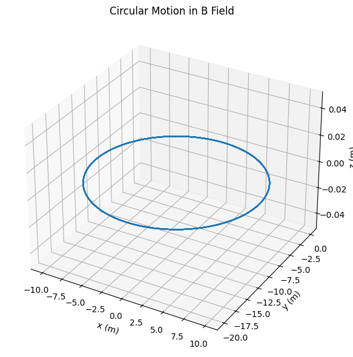
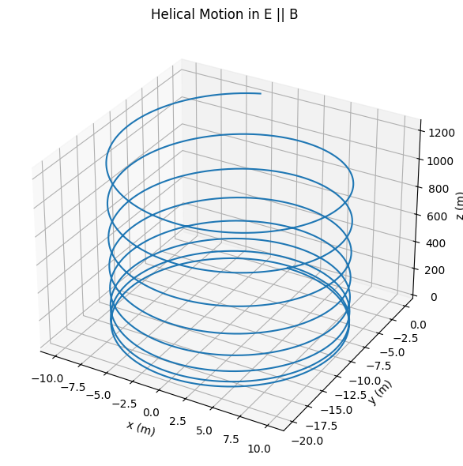
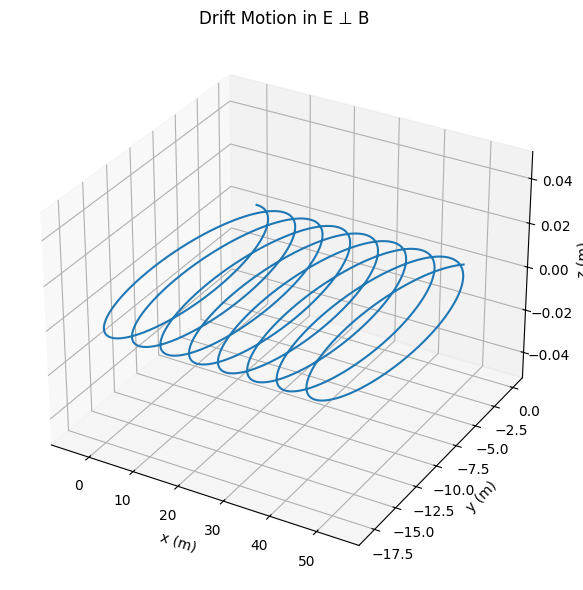

# Problem 1

# Simulating the Effects of the Lorentz Force

## 1. Introduction and Motivation

The Lorentz force governs the motion of charged particles in electromagnetic fields and is essential in understanding systems like:  
- Particle accelerators – guiding and accelerating beams.  
- Mass spectrometers – separating particles based on mass-to-charge ratio.  
- Plasma confinement devices (e.g., tokamaks) – controlling plasma using magnetic fields.  

Understanding the Lorentz force enables the design and analysis of such systems.

---

## 2. Lorentz Force Equation

The Lorentz force $\vec{F}$ acting on a charged particle is given by:

$$
\vec{F} = q (\vec{E} + \vec{v} \times \vec{B})
$$

Where:  
- $q$: Charge of the particle  
- $\vec{E}$: Electric field  
- $\vec{B}$: Magnetic field  
- $\vec{v}$: Particle velocity  
Using Newton’s Second Law:

$$
\vec{F} = m \frac{d\vec{v}}{dt}
$$

We obtain the equation of motion:

$$
m \frac{d\vec{v}}{dt} = q (\vec{E} + \vec{v} \times \vec{B})
$$

This equation is generally solved numerically due to the complexity of $\vec{v} \times \vec{B}$.

---

## 3. Simulation Overview

We simulate particle trajectories using the 4th-order Runge-Kutta method for accuracy.
**Scenarios Simulated:**  
1. Uniform magnetic field only: Circular motion.  
2. Parallel $\vec{E}$ and $\vec{B}$: Helical motion.  
3. Crossed fields: Drift motion.  

**Parameters that can be varied:**  
- Electric field strength $\vec{E}$  
- Magnetic field strength $\vec{B}$  
- Initial velocity $\vec{v}_0$  
- Charge $q$ and mass $m$

---

## 4. Code Implementation

See the attached Python script for full implementation: RK4 integration, Lorentz force application, and 3D visualization.



```python
import numpy as np
import matplotlib.pyplot as plt
from mpl_toolkits.mplot3d import Axes3D

# Ortak parametreler
q = 1.0       # Yük
m = 1.0       # Kütle
B = np.array([0, 0, 1.0])  # Sabit manyetik alan (z yönünde)
E = np.array([0.0, 0.0, 0.0])  # Başlangıçta sıfır elektrik alan
v0 = np.array([1.0, 1.0, 0.0])  # Başlangıç hızı

t = np.linspace(0, 20, 1000)  # Zaman

# 1. Dairesel hareket sadece B alanında
r_L = m * np.linalg.norm(v0[:2]) / (q * np.linalg.norm(B))
omega_c = q * np.linalg.norm(B) / m

x1 = r_L * np.cos(omega_c * t)
y1 = r_L * np.sin(omega_c * t)
z1 = np.zeros_like(t)

# 2. Helisel hareket E || B durumunda (E_z ≠ 0)
E = np.array([0.0, 0.0, 1.0])
v_drift = E / np.linalg.norm(B)
v_parallel = 1.0

x2 = r_L * np.cos(omega_c * t)
y2 = r_L * np.sin(omega_c * t)
z2 = v_parallel * t

# 3. E ⊥ B → Drift hareketi
E = np.array([1.0, 0.0, 0.0])  # x yönünde elektrik alan
v_EB = np.cross(E, B) / (np.linalg.norm(B) ** 2)

x3 = r_L * np.cos(omega_c * t) + v_EB[0] * t
y3 = r_L * np.sin(omega_c * t)
z3 = np.zeros_like(t)

# Grafikleri çiz
fig = plt.figure(figsize=(6, 18))

# Grafik 1: Circular motion in B
ax1 = fig.add_subplot(311, projection='3d')
ax1.plot(x1, y1, z1)
ax1.set_title('Circular Motion in B Field')
ax1.set_xlabel('x (m)')
ax1.set_ylabel('y (m)')
ax1.set_zlabel('z (m)')

# Grafik 2: Helical motion in E || B
ax2 = fig.add_subplot(312, projection='3d')
ax2.plot(x2, y2, z2)
ax2.set_title('Helical Motion in E || B')
ax2.set_xlabel('x (m)')
ax2.set_ylabel('y (m)')
ax2.set_zlabel('z (m)')

# Grafik 3: Drift motion in E ⊥ B
ax3 = fig.add_subplot(313, projection='3d')
ax3.plot(x3, y3, z3)
ax3.set_title('Drift Motion in E ⊥ B')
ax3.set_xlabel('x (m)')
ax3.set_ylabel('y (m)')
ax3.set_zlabel('z (m)')

plt.tight_layout()
plt.show()
```

## What it does ?


⚡️ **Interactive Lorentz Force Simulation**

🔍 **What It Does**

This code simulates the motion of a charged particle under electric and magnetic fields using the Lorentz force:

$$
\vec{F} = q(\vec{E} + \vec{v} \times \vec{B})
$$

---

🛠 **Features**

- Uses Runge-Kutta 4th order method for accurate motion updates
- Provides sliders to adjust:
  - \(\vec{E}\), \(\vec{B}\) field components
  - Initial velocity components
- Displays 3D trajectory of the particle in real time

---

🎯 **Purpose**

Helps visualize how different field setups affect particle motion — such as circular, helical, or drifting paths.

---
## Link to the interactive simulation:


[Link](https://colab.research.google.com/drive/17Ii1vDdz-1lLsmpS8hFB4P0gQn_fb6nJ#scrollTo=kaCkWEGUDROL&line=78&uniqifier=1)

## 6. Real-World Relevance
- Cyclotrons exploit circular motion in magnetic fields.  
- Magnetic traps and Penning traps confine particles using combined E and B fields.  
- In space physics, the Earth’s magnetic field and solar wind electric fields produce drift phenomena.

---

## 7. Extensions and Improvements

**Possible future improvements:**  
- Non-uniform $\vec{B}(x, y, z)$  
- Collisions or friction forces  
- Relativistic effects at high speeds  
- External potentials (e.g., gravitational field)

---